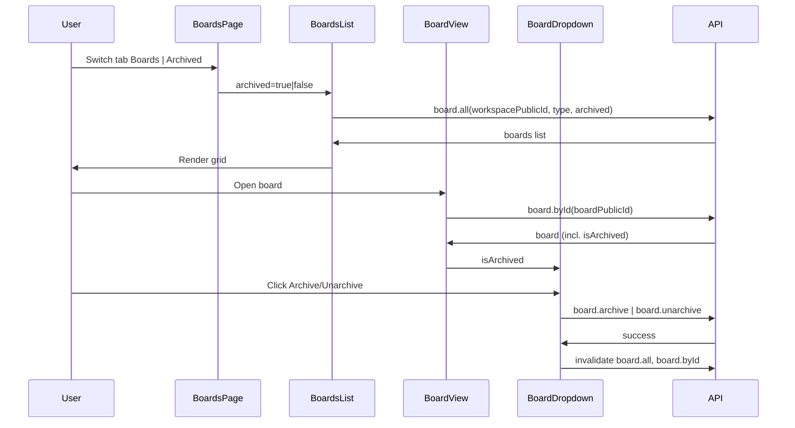

# Archived boards – step-by-step implementation plan

## Scope

- **Backend:** Add `isArchived` to boards, dedicated `board.archive` / `board.unarchive` procedures, extend `board.all` and repo to filter by archived, exclude archived from public workspace list, include `isArchived` in board fetch for the board view.
- **Frontend:** Boards page with client-side tabs (Boards | Archived), reuse settings-style tab UI; Archive/Unarchive in BoardDropdown with `isArchived` from parent; cache invalidation; i18n.

Templates page stays as-is (no Archived tab). Rate limiting deferred.

---

## Phase 1: Schema and migration

1. **Add `isArchived` to boards schema**

   - File: [packages/db/src/schema/boards.ts](packages/db/src/schema/boards.ts)
   - Add column: `isArchived: boolean("isArchived").notNull().default(false)` (after `type` / before table closing).
   - Optional: add index for list queries, e.g. `index("board_is_archived_idx").on(table.isArchived)` in the table's index array.

2. **Generate and apply migration**

   - From `packages/db`, run the project's migration command (e.g. `pnpm drizzle-kit generate` or equivalent) to create a new migration adding `isArchived` to `board`.
   - Name/pattern consistent with existing migrations (e.g. `AddIsArchivedToBoard.sql`).
   - Run migrations so the column exists before changing repo/API.

---

## Phase 2: Repository layer

3. **Extend `board.repo.update` to support `isArchived`**

   - File: [packages/db/src/repository/board.repo.ts](packages/db/src/repository/board.repo.ts)
   - In the `update` function's `boardInput` type, add `isArchived?: boolean`.
   - In the `.set()` call, add `...(boardInput.isArchived !== undefined && { isArchived: boardInput.isArchived })` (or equivalent) so archive/unarchive can set it.

4. **Filter by `isArchived` in `getAllByWorkspaceId`**

   - Same file. Extend `opts` to `opts?: { type?: "regular" | "template"; archived?: boolean }`.
   - In the `where` clause, add: when `opts?.archived !== undefined`, add `eq(boards.isArchived, opts.archived)` so:
     - `archived: false` or omitted → active boards only.
     - `archived: true` → archived boards only.

5. **Return `isArchived` from `getByPublicId`**

   - Same file, in the `getByPublicId` query's `columns` for the board, add `isArchived: true` so the board view (and `board.byId`) can pass it to the dropdown.

6. **Exclude archived boards from public workspace boards**

   - File: [packages/db/src/repository/workspace.repo.ts](packages/db/src/repository/workspace.repo.ts)
   - In `getBySlugWithBoards`, inside the `boards` relation's `where`, add `eq(boards.isArchived, false)` alongside the existing `isNull(boards.deletedAt)` and `eq(boards.visibility, "public")` so the public workspace page never lists archived boards.

---

## Phase 3: API layer

7. **Add `board.archive` and `board.unarchive` procedures**

   - File: [packages/api/src/routers/board.ts](packages/api/src/routers/board.ts)
   - Both: `protectedProcedure`, input `z.object({ boardPublicId: z.string().min(12) })`, use `getWorkspaceAndBoardIdByBoardPublicId` + `assertUserInWorkspace` (same pattern as `update`/`delete`).
   - **archive:** call `boardRepo.update(ctx.db, { boardPublicId, isArchived: true })` (ensure repo's `update` accepts partial updates and only sets `isArchived` when provided).
   - **unarchive:** call with `isArchived: false`.
   - Return something simple, e.g. `{ success: true }` or the updated board; document in OpenAPI meta if you add it.

8. **Extend `board.all` input and query**

   - Same file. Add to input: `archived: z.boolean().optional()`.
   - In the query handler, pass `archived: input.archived` into `boardRepo.getAllByWorkspaceId` (in addition to `type: input.type`). When `archived` is `undefined` or `false`, the repo returns non-archived boards; when `true`, archived only.

9. **Ensure `board.byId` output includes `isArchived`**

   - No input change. The procedure's output is inferred from `boardRepo.getByPublicId`; once that returns `isArchived` (step 5), the API response type will include it. Verify the frontend type for `board.byId` includes `isArchived` after repo change.

---

## Phase 4: Frontend – boards list and tabs

10. **Add tab state and tab bar to Boards page**

    - File: [apps/web/src/views/boards/index.tsx](apps/web/src/views/boards/index.tsx)
    - Only show tabs when `!isTemplate` (boards page only, not templates).
    - Add state: e.g. `const [activeTab, setActiveTab] = useState<"boards" | "archived">("boards") `(or use URL query `?tab=archived` and read/write via router for shareable links).
    - Reuse the settings tab UI pattern from [apps/web/src/components/SettingsLayout.tsx](apps/web/src/components/SettingsLayout.tsx):
      - **Desktop:** A nav with two items "Boards" and "Archived"; active tab via `activeTab === "boards"` / `"archived"`; onClick calls `setActiveTab("boards")` or `setActiveTab("archived")` (no `Link`/router if state-only).
      - **Mobile:** Same Listbox + ListboxButton + ListboxOptions pattern as Settings, but options are "Boards" and "Archived", and `onChange` sets `activeTab` instead of `router.push`.
    - Render `BoardsList` twice (or once with a prop): one for active boards, one for archived, and show the one that matches `activeTab`. Pass a new prop to indicate archived (see next step).

11. **Extend BoardsList to support archived filter**

    - File: [apps/web/src/views/boards/components/BoardsList.tsx](apps/web/src/views/boards/components/BoardsList.tsx)
    - Add prop: `archived?: boolean` (default `false`).
    - In `api.board.all.useQuery`, pass `archived: archived ?? false` in the input (alongside `workspacePublicId` and `type`).
    - When `archived` is true, show the same grid but use empty state copy for "No archived boards" (add i18n key and use it when `archived && data?.length === 0`).

12. **Wire BoardsPage to two BoardsList instances**

    - In [apps/web/src/views/boards/index.tsx](apps/web/src/views/boards/index.tsx), render:
      - When `activeTab === "boards"`: `<BoardsList isTemplate={!!isTemplate} archived={false} />`
      - When `activeTab === "archived"`: `<BoardsList isTemplate={!!isTemplate} archived={true} />`
    - Only render the tab content for the active tab to avoid duplicate requests if you prefer, or render both and hide with CSS; either way ensure the correct `archived` value is passed.

---

## Phase 5: Frontend – BoardDropdown and board view

13. **Pass `isArchived` into BoardDropdown**

    - File: [apps/web/src/views/board/index.tsx](apps/web/src/views/board/index.tsx)
    - Where `BoardDropdown` is rendered, add prop: `isArchived={boardData?.isArchived ?? false}` (boardData comes from `board.byId`, which will include `isArchived` after backend steps).

14. **Add Archive / Unarchive to BoardDropdown**

    - File: [apps/web/src/views/board/components/BoardDropdown.tsx](apps/web/src/views/board/components/BoardDropdown.tsx)
    - Add prop `isArchived?: boolean` to the component props.
    - Add a dropdown item: label `isArchived ? t\`Unarchive\` : t\`Archive\``, action that calls `archiveBoard.mutate({ boardPublicId })` or `unarchiveBoard.mutate({ boardPublicId })` (use `api.board.archive.useMutation()` and `api.board.unarchive.useMutation()`).
    - Show this item only when `!isTemplate` (archive only for boards, not templates).
    - On success of either mutation: invalidate `board.all` for the current workspace (e.g. `utils.board.all.invalidate({ workspacePublicId })`) and optionally `utils.board.byId.invalidate(...)` so the header reflects "Unarchive" after archiving. Handle loading/error state on the button if desired.

---

## Phase 6: i18n and empty state

15. **Add translations**

    - Use Lingui macros where the new strings are used (already in place for BoardDropdown and BoardsList).
    - Extract/compile so new strings land in locale files. Keys to add:
      - "Archive" (dropdown)
      - "Unarchive" (dropdown)
      - "Archived" (tab label)
      - "No archived boards" (and optionally "Boards you archive will appear here") for the archived tab empty state in BoardsList.

---

## Phase 7: Verification and edge cases

16. **Manual / automated checks**

    - Boards tab: only non-archived boards; Archived tab: only archived boards.
    - Archive from board view: dropdown shows "Unarchive"; after unarchive, shows "Archive".
    - Direct URL to an archived board: board loads, dropdown shows "Unarchive".
    - Public workspace page: archived boards do not appear.
    - Templates page: unchanged; no "Archived" tab; templates do not show archive in dropdown (already gated by `isTemplate`).
    - Cache: after archive/unarchive, both tabs and board header update (invalidation in step 14).

---

## Data flow summary

---

## File change summary

| Area | Files |

|------|--------|

| Schema | [packages/db/src/schema/boards.ts](packages/db/src/schema/boards.ts); new migration under `packages/db/migrations/` |

| Repo | [packages/db/src/repository/board.repo.ts](packages/db/src/repository/board.repo.ts), [packages/db/src/repository/workspace.repo.ts](packages/db/src/repository/workspace.repo.ts) |

| API | [packages/api/src/routers/board.ts](packages/api/src/routers/board.ts) |

| Frontend | [apps/web/src/views/boards/index.tsx](apps/web/src/views/boards/index.tsx), [apps/web/src/views/boards/components/BoardsList.tsx](apps/web/src/views/boards/components/BoardsList.tsx), [apps/web/src/views/board/index.tsx](apps/web/src/views/board/index.tsx), [apps/web/src/views/board/components/BoardDropdown.tsx](apps/web/src/views/board/components/BoardDropdown.tsx) |

| i18n | New strings in components; run extract/compile so locale files update |

Order of implementation: 1 → 2 → 3–6 (repo) → 7–9 (API) → 10–12 (tabs + list) → 13–14 (dropdown) → 15 (i18n) → 16 (verification).